

<table>
    <theader>
        <tr>
            <td></td>
            <th>
                UNIVERSIDAD NACIONAL DE SAN AGUSTIN 
                FACULTAD DE INGENIERÍA DE PRODUCCIÓN Y SERVICIOS 
                DEPARTAMENTO ACADÉMICO DE INGENIERÍA DE SISTEMAS E INFORMÁTICA 
                ESCUELA PROFESIONAL DE INGENIERÍA DE SISTEMAS
            </th>
            <td></td>
        </tr>
    </theader>
    <tbody>
        <tr><td colspan="3">Formato: Informe de Práctica de Laboratorio</td></tr>
        <tr><td>Aprobación:  2022/03/01</td><td>Código: GUIA-PRLD-001</td><td>Página: 1</td></tr>
    </tbody>
</table>

INFORME DE LABORATORIO 

<table>
<theader>
<tr><th colspan="6">INFORMACIÓN BÁSICA</th></tr>
</theader>
<tbody>
<tr><td>ASIGNATURA:</td><td colspan="5">Programación Web 2</td></tr>
<tr><td>TÍTULO DE LA PRÁCTICA:</td><td colspan="5">Python</td></tr>
<tr>
<td>NÚMERO DE PRÁCTICA:</td><td>04</td><td>AÑO LECTIVO:</td><td>2022 A</td><td>NRO. SEMESTRE:</td><td>III</td>
</tr>
<tr>
<td>FECHA INICIO::</td><td>29-May-2023</td><td>FECHA FIN:</td><td>05-Jun-2023</td><td>DURACIÓN:</td><td>04 horas</td>
</tr>
<tr><td colspan="6">DOCENTE:
<ul>
<li>Anibal Sardon </li>
</ul>
</td>
</<tr>
<tr><td colspan="6">ALUMNO:
<ul>
<li>Pedro Luis Christian Zapana Romero - pzapanar@unsa.edu.pe </li>
</ul>
</td>
</<tr>
</tdbody>
</table>

[![License][license]][license-file]
[![Downloads][downloads]][releases]
[![Last Commit][last-commit]][releases]

[![Debian][Debian]][debian-site]
[![Git][Git]][git-site]
[![GitHub][GitHub]][github-site]

#

## COMPETENCIA DEL CURSO

- General: C.c. Diseña responsablemente aplicaciones web, sus componentes o procesos para satisfacer necesidades dentro de restricciones realistas: económicas, medio ambientales, sociales, políticas, éticas, de salud, de seguridad, manufacturación y sostenibilidad.
- Específica: C.m. Construye responsablemente soluciones con tecnología web siguiendo un proceso adecuado llevando a cabo las pruebas ajustada a los recursos disponibles del cliente.
- Específica: C.p. Aplica de forma flexible técnicas, métodos, principios, normas, estándares y herramientas del desarrollo web necesarias para la construcción de aplicaciones web e implementación de estos sistemas en una organización.

## RESULTADO DEL ESTUDIANTE
- RE. 2: La capacidad de aplicar dise ̃no de ingeniería para producir soluciones a problemas y diseñar sistemas, componentes o procesos para satisfacer necesidades específicas dentro de consideraciones realistas en los aspectos de salud pública, seguridad y bienestar; factores globales, culturales, sociales, económicos y ambientales.
RE. 8: La capacidad de crear, seleccionar y utilizar técnicas, habilidades, recursos y herramientas modernas de ingeniería y tecnologías de la información, incluyendo la predicción y el modelamiento, con una comprensión de las limitaciones.

## EQUIPOS, MATERIALES Y TEMAS
- Sistema Operativo (GNU/Linux de preferencia).
- GNU Vim.
- Python 3.
- Git.
- Cuenta en GitHub con el correo institucional.
- Entorno virtual.

## DIRECTORIO DE TRABAJO
- Cree su directorio de trabajo.
- Luego, dirÍjase a este directorio, para clonar su repositorio y continuar sus practicas.

    Creando directorio de trabajo
    
          $ mkdir -p $HOME/rescobedoq/
    
    DirijÍendonos al directorio de trabajo
    
          $ cd $HOME/rescobedoq/
    
    Clonando repositorio GitHub
    
          $ git clone [URL_DE_SU_GITHUB_PRIVADO]
    
    Creando directorio para laboratorio
    
          $ mkdir -p $HOME/rescobedoq/pw2-lab-c-23a/lab04/exercises/
    
- Siempre evalue utilizar un archivo .gitignore para no considerar algunos archivo innecesarios
sobre todo para el repositorio GitHub.
- Pueden haber varios de estos archivos, ubicados estrat ́egicamente, por ejemplo s ́olo para un
laboratorio particular.

   Creando .gitignore
    
          $ vim $HOME/rescobedoq/pw2-lab-c-23a/lab04/.gitignore
          
   Ejemplo de .gitignore

          my_env/bin/*
          my_env/lib/*
          my_env/src/__pycache__/*
          *.pyc
          Tarea-del-Ajedrez/__pycache__/*
          
## MARCO TEORICO

### Python
- Python es un lenguaje de programaci ́on interpretado no fuertemente tipado.
### Instalaci ́on en GNU/Linux
- Para instalar Python 3 en cualquier distribuci ́on GNU/Linux use sus mismos repositorios.
- Por ejemplo en sistemas operativos compatibles con GNU/Linux Debian use alguno de los dos
comandos siguientes:

   Instalar Python en GNU/Linux Debian

          # apt-get install python3
      
   Instalar Python en GNU/Linux Ubuntu

          $ sudo apt-get install python3
      
### Instalación en MS Windows
- Para descargar Python compatible con sistemas operativos MS Windows utilice alguno de los instaladores de: https://www.python.org/downloads/windows/
- Descargar e instalar en sistemas operativos MS Windows, por lo general es muy sencillo. Además si usted es un usuario nativo de windows este proceso será casi intuitivo. No tenga miedo de instalar estos programas todo es software libre, asi que no necesitará parches o cracks. :)

### Instalación en MacOS
- Para instalar Python 3 en sistemas operativos MacOS puede descargar el instalador desde: urlhttps://www.python.org/downloads/macos/ o usar brew:

    Instalar Python en MacOS

          $ brew install python
          
### Comprobar presencia y versión de Python
- Debe comprobar que la instalación y el reconocimiento del compilador ya estan presentes en su sistema operativo:

    Verificando presencia y versi ́on de Python

          $ python3 --version

- Usted debería obtener como salida la versión que tiene instalada.

    Verificando presencia y versi ́on de Python
   
          Python 3.11.2
          
### Hola mundo
- Cree su primer ejercicio helloworld.py

    Creando el archivo helloworld.py

          $ vim helloworld.py

    helloworld.py

          print("Hello World!")
          
- Para ejecutar su script helloworld.py ejecute el siguiente comando:

    Ejecutando el script helloworld.py

          $ python3 helloworld.py
          
    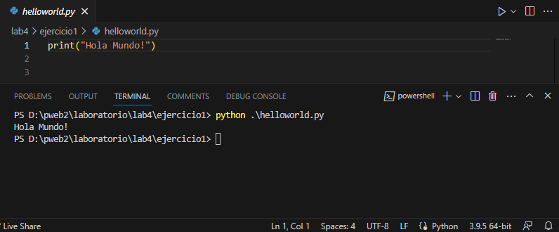
### Comentarios en Python
- Los comentarios en Python sólo se aplican por cada línea.
- Pero usted puede utilizar várias técnicas para comentar en el editor Vim.

    Comentar rango de l ́ıneas 5-10

          :3,5s/^/#

    Comentar todas las l ́ıneas que tengan la palabra print

          :g/print/s/^/#
    
    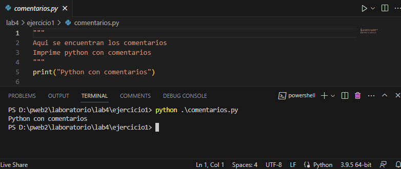
### Virtual Environment
- La reutilización de código fuente (paquetes, librerias, plugins, etc.) de terceros nos permite construir software más complejo, sobre todo con menos tiempo.
- En NodeJS se usaban paquetes instalados en el directorio de trabajo y no de manera global, registrando estos paquetes en sus versiones en el archivo package.json.
- Por eso este modo de trabajo nos permite tener distintos proyectos con distintas bibliotecas, de distintas versiones, en la misma m ́aquina, sin que existan conflictos.
- Para compartir el proyecto se debe compartir el archivo package.json y luego llamar a ”npm install”para instalar las bibliotecas adecuadas para el proyecto.
- Java usa ant y maven, junto con archivos xml para realizar estas tareas.
- Python tiene virtualenv, para crear este espacio de trabajo.
- Python utiliza el manejador de paquetes pip.
### Pip
- Instalemos pip, una herramienta que instalará y administrará los paquetes de programación que queramos usar en nuestros proyectos de desarrollo.
    
    Instalación de pip

          $ sudo apt-get install -y python3-pip
    
### Garantizando posibilidades para trabajar con entornos virtuales
- Paquetes y herramientas de desarrollo más para instalar para garantizar que tengamos una configuración sólida para nuestro entorno de programación.

    Instalaciónes previas para entorno virtual
    
          $ sudo apt-get install build-essential libssl-dev libffi-dev python3-dev
   
### Instalación de paquetes para crear entornos virtuals
- Los entornos virtuales permiten tener un espacio aislado en los proyectos Python
- Garantizando que cada proyecto pueda tener su propio conjunto de dependencias que no interrumpirán a otros proyectos.
- Manejando diferentes versiones de los paquetes. Esto es especialmente importante cuando se trabaja con paquetes de terceros.
- Puede varios entornos de programación.
- Cada entorno es un directorio en la que se ubicaran sus scripts.
- Usaremos el módulo venv , que es parte de la biblioteca estándar de Python.
- Instalemos venv escribiendo:

    Instalación del entorno virtual

          $ sudo apt-get install -y python3-venv
          $ sudo apt-get install python3-virtualenv
  
### Crear un directorio para entorno virtual
- Para crear un ambiente elija en qué directorio se va crear el entorno virtual.

    Creando directorio para entorno virtual

          $ mkdir -p $HOME/rescobedoq/pw2-lab-c-23a/lab04/my_env
     
### Crear entorno virtual en un directorio
- En este directorio crear un entorno virtual ejecutando el siguiente comando:

    Creando entorno virtual
          
          $ cd $HOME/rescobedoq/pw2-lab-c-23a/lab04/my_env
          $ virtualenv -p python3
        
### Estructura de un entorno virtual
- Estudie la estructura del entorno virtual.
- Dentro del directorio para el entorno virtual se debió crear un subdirectorio src/ con el siguiente contenido:
    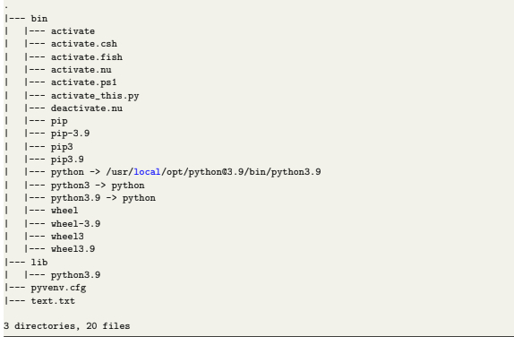
## Activando entorno virtual
- En el directorio de trabajo active el entorno virtual ejecutando el script activate:

    Activando entorno virtual
    
          $ cd $HOME/rescobedoq/pw2-lab-c-23a/lab04/exercises/
          $ source ./../my_env/bin/activate
          (my_env) user@localhost:$
        
### Trabajando dentro del entorno virtual
- Cree el Hola Mundo con su entorno virtual activado.
- Al finalizar todos sus ejercicios, no olvide de desactivar el entorno virtual.

    Trabajando en el entorno virtual

          (my_env) user@localhost:$ vim hello.py
          (my_env) user@localhost:$ python3 hello.py
          (my_env) user@localhost:$ deactivate
          user@localhost:$
          
    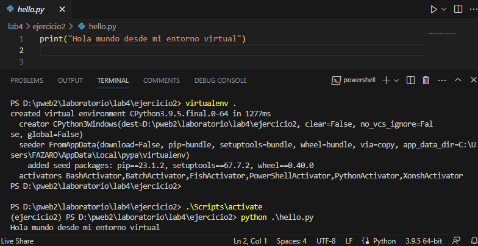
## Ejercicios
- Ejercicios sobre matrices de tamaño NxN.
### Matriz escalar
- Determine si una matriz es escalar.
- Pruebe el método esEscalar().
- Ejecucion 

    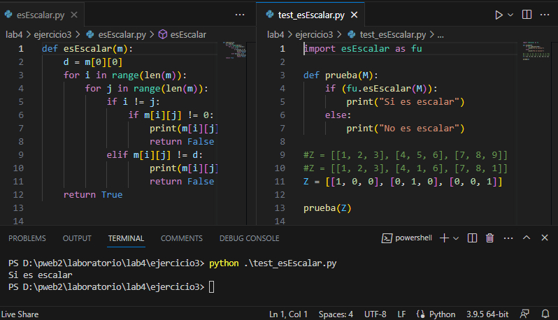
### Matriz unitaria
- Determine si una matriz es unitaria:
- Pruebe el método esUnitaria()
- Ejecucion

    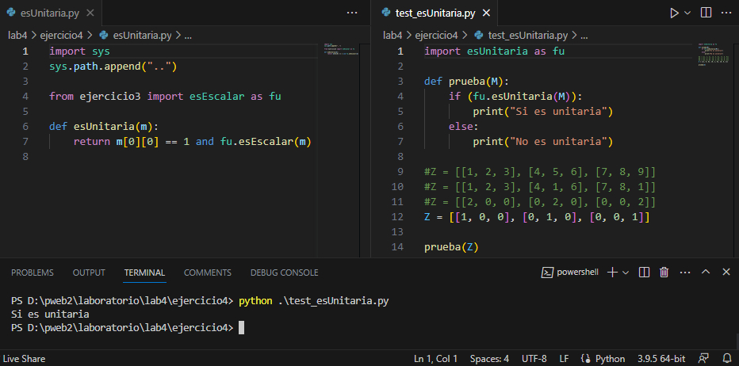
    
### Enviar avances a repositorio GitHub
- Se recomienda que se hagan commits en cada avance sustancial, preprogramado por usted mismo, sin embargo, siempre haga commits para guardar sus avances.
– Cuando este trabajando en los laboratorios de la escuela y haya terminado de enviar sus avances, debe eliminar el directorio de trabajo.
– Finalmente, siempre apague la computadora y deje todo en orden, como le gustaría haber encontrado el laboratorio. Ponga el ejemplo.
    
   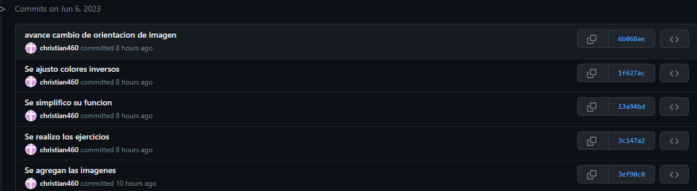
   
   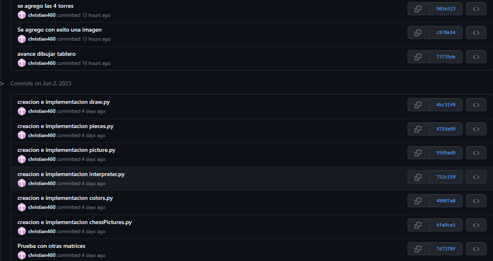
   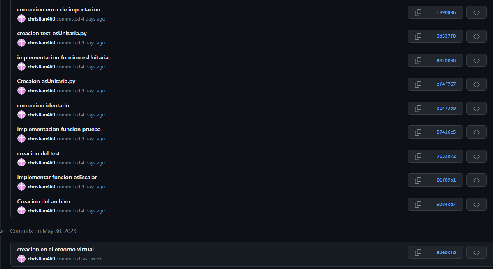

## TAREA
- URL GitHub de Tarea del Ajedrez https://github.com/rescobedoq/pw2/tree/main/labs/lab04/Tarea-del-Ajedrezhttps://www.overleaf.com/project/647e1231685f7e122fcc4dcf
- En esta tarea usted pondrá en práctica sus conocimientos de programación en Python para dibujar un tablero de Ajedrez.
- La parte gráfica ya está programada, usted sólo tendrá que concentrarse en las estructuras de datos subyacentes.
- Con el código proporcionado usted dispondrá de varios objetos de tipo Picture para poder realizar su tarea.
- Estos objetos estarán disponibles importando la biblioteca: chessPictures y estarán internamente representados con arreglos de strings que podrá revisar en el archivo pieces.py
- La clase Picture tiene un sólo atributo: el arreglo de strings img, el cual contendrá la representación en caracteres de la figura que se desea dibujar.
- La clase Picture ya cuenta con una función implementada, no debe modificarla, pero si puede usarla para implementar sus otras funciones:
- invColor: recibe un color como un caracter de texto y devuelve su color negativo, también como texto, deberá revisar el archivo colors.py para conocer los valores negativos de cada caracter.
- La clase Picture contará además con varios métodos que usted deberá implementar.
    - verticalMirror: Devuelve el espejo vertical de la imagen
    - horizontalMirror: Devuelve el espejo horizontal de la imagen
    - negative: Devuelve un negativo de la imagen
    - join: Devuelve una nueva figura poniendo la figura del argumento al lado derecho de la figura actual
    - up: Devuelve una nueva figura poniendo la figura recibida como argumento, encima de la figura actual
    - under: Devuelve una nueva figura poniendo la figura recibida como argumento, sobre la figura actual
    - horizontalRepeat: Devuelve una nueva figura repitiendo la figura actual al costado la cantidad de veces que indique el valor de n
    - verticalRepeat: Devuelve una nueva figura repitiendo la figura actual debajo, la cantidad de veces que indique el valor de n
- Tenga en cuenta que para implementar todos estos métodos, sólo deberá trabajar sobre la representaci ón interna de un Picture, es decir su atributo img.
- Para dibujar una objeto Picture bastará importar el método draw de la biblioteca interpreter y usarlo.
- Ejercicios:
    - Para resolver los siguientes ejercicios sólo está permitido usar ciclos, condicionales,definición de listas por comprensión, sublistas, map, join, (+), lambda, zip, append, pop, range.
    - Implemente los métodos de la clase Picture. Se recomienda que implemente la clase picture por etapas, probando realizar los dibujos que se muestran en la siguiente preguntas.
    - Usando únicamente los métodos de los objetos de la clase Picture dibuje las siguientes figuras (invoque a draw).
    
    - Ejercicio A: Se utiliza la funcion dibujar() que recibe los parametros picture que es la figura a dibujar, x que representa la posicion q tomara en el eje x, y que representa la posicion q tomara en el eje y, por ultimo color que puede ser claro o el inverso. Por medio del metodo parseLine(), que utiliza una estructura for en el metodo drawn.line() con los colores que corresponda segun el parametro registrado.
    
    
    - Ejercicio C: Se utilizo la estructura for para con este bucle dibujar la figura en las 4 veces que nos pide, por medio del metodo dibujar() teniendo en cuenta que el for de este metodo ayuda a poder ubicar correctamente las figuras ya que al metodo parseLine() moviendo la posicion de la magen a dibujar al sumar el iterador con la coordenada y. 
    
    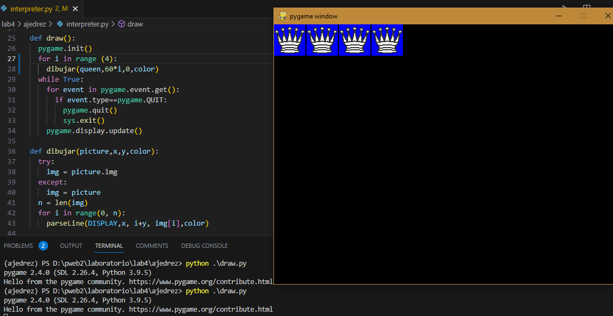
    - Ejercicio D: Se utiliza el metodo dibujar() en una estructura for para poder dibujar un cuadrado de cada color en cada iteracion ubicandolos en las posiciones indicadas de la ventana teniendo en cuenta que al ser cuadrados de 60 de alto y ancho las ubicaciones que se obtendran ser multiplos del mismo.
    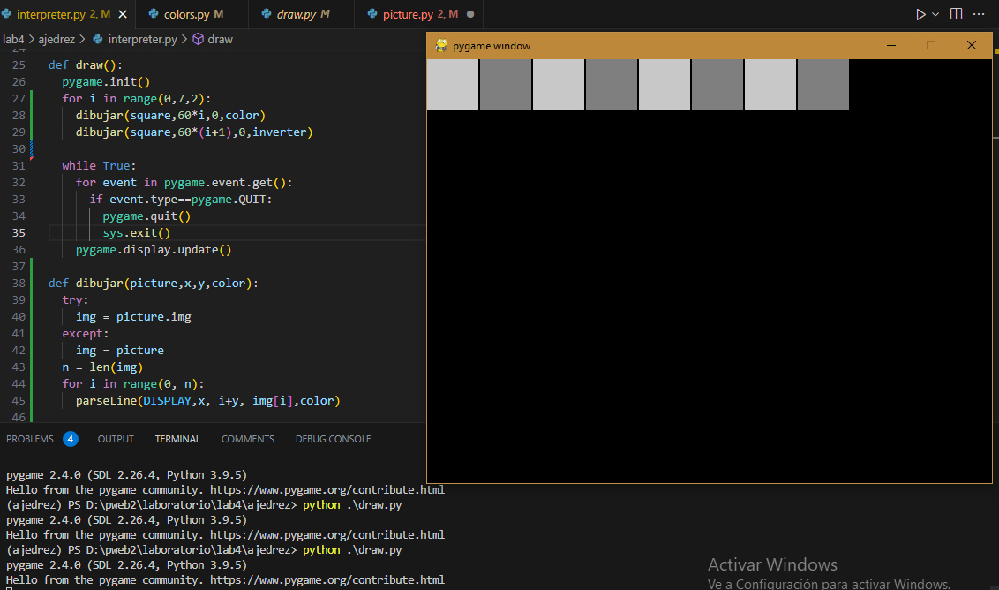
    - Ejercicio E: Se utiliza la misma forma del ejercicio d pero cambiando el orden de los cuadrados a crear.
    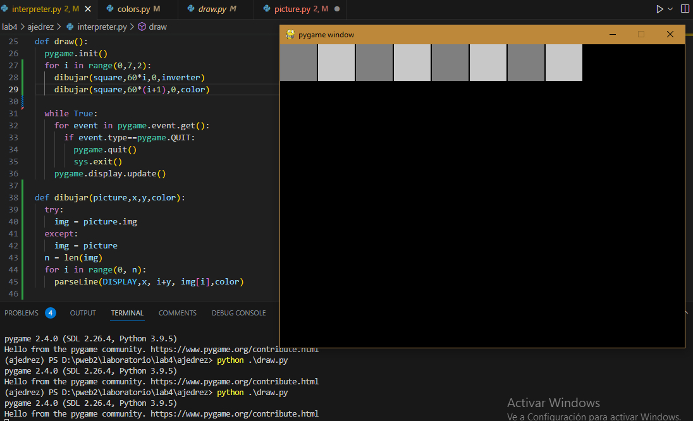
    - Ejercicio F: Por medio de dos estructuras for se trabaja con la ventana como si fuera una matriz la varible del primer for es utilizada para en cada iteracion mover los cuadrados en el eje x, para asi crear filas con los cuandrados; la variable del segundo for se encarga de ubicar a los cuadrados en el eje. Ademas de usarse una estructura if que nos dice si la columna es par, en ese caso iniciar la fila con un cuadrado claro en caso contrario sera un cuadrado oscuro hasta rellenar las 4 filas que son requeridas.
    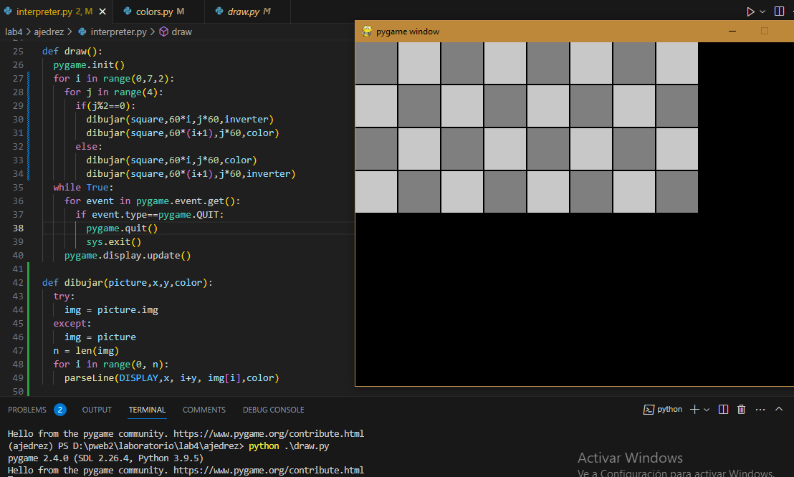
   - Ejercicio G: Utilizando como base el ejercicio F al aumentar las iteraciones se logra constuir un tablero completo de Ajedrez, luego por medio del metodo piezas() son insertadas todas las piezas importando las imagenes por medio del metodo pygame.image.load() para luego transformar sus dimensiones para poder tener el tamaño adecuado para su casilla para finalmente agreagrarla al tablero mediante el metodo DISPLAY.blint() que toma la imagen y la inserta en las coordenadas que sean enviadas.  
    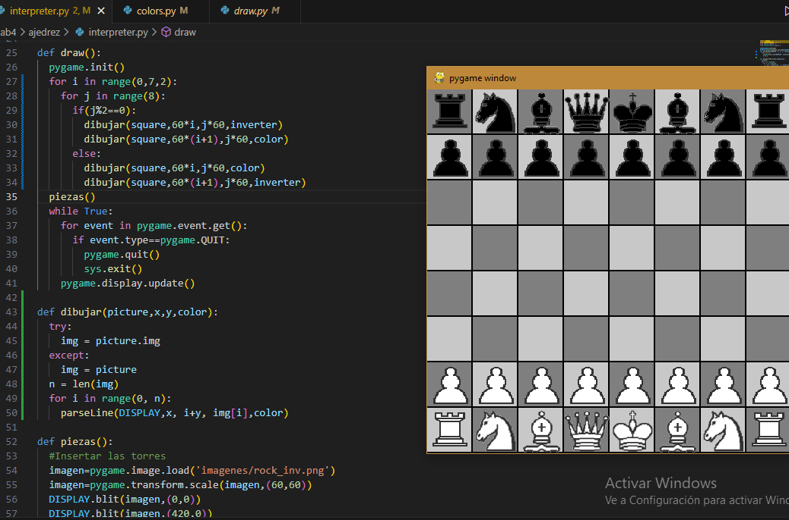

## CUESTIONARIO
### ¿Para qué sirve el directorio pycache?
- En el drectorio pycache son guardadas versiones compiladas de los modulos con los que se esta trabajando para asi poder acelerar la carga de cada modulo.

#

### REFERENCIAS
- https://www.w3schools.com/python/python_reference.asp
- https://docs.python.org/3/tutorial/
- Link del repostorio: https://github.com/christian460/lab4
- Link del trabajo en latex: https://www.overleaf.com/7636968211nykswkvcqzry

#

[license]: https://img.shields.io/github/license/rescobedoq/pw2?label=rescobedoq
[license-file]: https://github.com/rescobedoq/pw2/blob/main/LICENSE

[downloads]: https://img.shields.io/github/downloads/rescobedoq/pw2/total?label=Downloads
[releases]: https://github.com/rescobedoq/pw2/releases/

[last-commit]: https://img.shields.io/github/last-commit/rescobedoq/pw2?label=Last%20Commit

[Debian]: https://img.shields.io/badge/Debian-D70A53?style=for-the-badge&logo=debian&logoColor=white
[debian-site]: https://www.debian.org/index.es.html

[Git]: https://img.shields.io/badge/git-%23F05033.svg?style=for-the-badge&logo=git&logoColor=white
[git-site]: https://git-scm.com/

[GitHub]: https://img.shields.io/badge/github-%23121011.svg?style=for-the-badge&logo=github&logoColor=white
[github-site]: https://github.com/

[Vim]: https://img.shields.io/badge/VIM-%2311AB00.svg?style=for-the-badge&logo=vim&logoColor=white
[vim-site]: https://www.vim.org/

[Java]: https://img.shields.io/badge/java-%23ED8B00.svg?style=for-the-badge&logo=java&logoColor=white
[java-site]: https://docs.oracle.com/javase/tutorial/

[![Debian][Debian]][debian-site]
[![Git][Git]][git-site]
[![GitHub][GitHub]][github-site]

[![License][license]][license-file]
[![Downloads][downloads]][releases]
[![Last Commit][last-commit]][releases]
